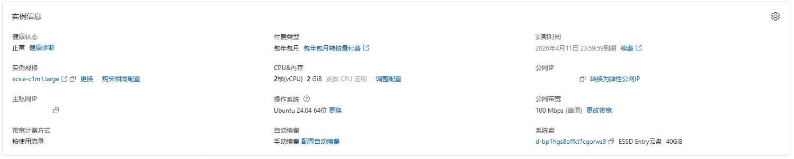

# 项目部署

项目部署在阿里云 ECS 服务器上，具体配置及系统信息如下。



# 制作项目发布包

## vue

vite 在使用 npm run build 指令打包 vue 项目时会自动寻找项目根目录下.env.production 文件为 vue 项目配置生产环境。
同时在使用 npm run dev 时则会自动寻找.env.development 文件为 vue 项目配置开发环境，可以通过 import.meta.env.[xxxx]来访问环境变量。
这样可以有效便捷地实现开发环境和产品环境之间的切换。

```typescript
// .env.development
VITE_BASE_URL=http://127.0.0.1:8000/api
VITE_DEBUG=true
```

```typescript
// .env.production
VITE_BASE_URL=/api  ## 配合nginx反向代理
VITE_DEBUG=false
```

```typescript
// vite.config.ts
export default defineConfig({
  ...
  server: {
    proxy: {
      '/media': {
        target: 'http://127.0.0.1:8000', // 使用localhost会报错[vite] http proxy error
        changeOrigin: true,
      },
    },
  },
})
```

## django

django 项目打包直接压缩整个项目文件夹就可以，但需要注意以下几点：① 设置 settings.py 下的 DEBUG=False ② 按需求配置 ALLOWED_HOSTS ③ 注意开发环境下的数据库密码和产品环境下的数据库密码设置

## 配置 Nginx

Nginx 需要写一个配置文件 nginx.conf，在产品服务器安装 Nginx 后替换配置文件实现对资源的代理。

```
# 需要根据情况修改
user www-data;

worker_processes auto;
pid /run/nginx.pid;
error_log /var/log/nginx/error.log;
include /etc/nginx/modules-enabled/*.conf;

events {
	worker_connections 768;
}

http {

	##
	# Basic Settings
	##

	sendfile on;
	tcp_nopush on;
	types_hash_max_size 2048;
	include /etc/nginx/mime.types;
	default_type application/octet-stream;

	##
	# SSL Settings
	##

	ssl_protocols TLSv1 TLSv1.1 TLSv1.2 TLSv1.3; # Dropping SSLv3, ref: POODLE
	ssl_prefer_server_ciphers on;

	##
	# Logging Settings
	##

	access_log /var/log/nginx/access.log;

	##
	# Gzip Settings
	##

	gzip on;

	##
	# Virtual Host Configs
	##

    server {
		listen     80;
        server_name _;
        # 需要根据情况修改前端项目所在地址
        root /var/WebAppV0.1/vue;

        location / {
            # 需要根据情况修改前端项目所在地址
            root /var/WebAppV0.1/vue;
            index index.html;
            try_files $uri $uri/ /index.html;
        }

        location /api/ {
        # 需要根据情况修改反代地址
        proxy_pass http://120.55.101.129:8000/api/;
        proxy_set_header Host $host;
        proxy_set_header X-Real-IP $remote_addr;
        proxy_set_header X-Forwarded-For $proxy_add_x_forwarded_for;
        proxy_set_header X-Forwarded-Proto $scheme;
        }

        location /media/ {
        # 需要根据情况修改反代地址
        proxy_pass http://120.55.101.129:8000/media/;
        proxy_set_header Host $host;
        proxy_set_header X-Real-IP $remote_addr;
        proxy_set_header X-Forwarded-For $proxy_add_x_forwarded_for;
        proxy_set_header X-Forwarded-Proto $scheme;
        }
	}
}
```

## 配置 Gunicorn

在 django 项目的根目录创建两个文件：gunicorn_conf.py 和 run.sh，前者指定 gunicorn 的启动配置。
后者编写在 linux 系统下运行的终端命令。

```python
# gunicorn_conf.py
import sys
import os

# gunicorn/django  服务监听地址、端口
bind = "127.0.0.1:8000"

# gunicorn worker 进程个数，建议为： CPU核心个数 * 2 + 1
workers = 5

# gunicorn worker 类型， 使用异步的event类型IO效率比较高
worker_class = "gevent"

# 日志文件路径
errorlog = "/var/WebAppV0.1/gunicorn.log"
loglevel = "info"

cwd = os.getcwd()
sys.path.append(cwd)
```

```
# run.sh
#!/bin/bash
DIR="$( cd "$( dirname "$0" )" && pwd )"
echo $DIR

cd $DIR

# ulimit -n 50000
# gunicorn --config=gunicorn_conf.py personal_website_python.wsgi &> /dev/null &
nohup gunicorn --config=gunicorn_conf.py personal_website_python.wsgi >> gunicorn.log 2>&1 &
```

# 部署过程

## 配置 Nginx 环境

Ubuntu 系统下使用如下的指令安装 Nginx，安装完成后可以一般在系统根目录的 etc 目录下可以找到 nginx 这么个文件夹。
里面存放着 nginx 的各种配置，需要把安装自动生成的 nginx.conf 替换我们编写的 nginx.conf。

```
npm install nginx
```

## 配置 Python 环境

### 切换 python 版本

Linux 系统一般都自带 Python 环境，但这个 Python 往往不是我们 django 项目需要的版本。比如说阿里云服务器安装的 Ubuntu 系统
提供的是最新的 python3.12，而我们需要的是 python3.11.2。此时需要我们更换 python 版本，我们采取保留原有的 python3.12 直接安装 python3.11.2 并切换当前 python 版本的方式（由于卸载再重装遇到了问题）。

1（可选）：在安装 Python 3.11 之前，推荐先对 Ubuntu 进行更新，避免安装期间发生冲突。还可以确保所有软件包都是最新的。

```
sudo apt update
sudo apt upgrade
```

2：安装 Python 3.11。

```
sudo apt install python3.11
```

3：在 Ubuntu 中切换默认 Python 版本

```
which python3.11
sudo update-alternatives --install /usr/bin/python python /usr/bin/python3.11
```

### 创建虚拟环境

在安装正确版本的 python 后，由于最新的 Ubuntu 无法直接使用 pip install，需要在虚拟环境中使用 pip 来安装包，所以我们还要创建一个 python 虚拟环境。apt 软件源（阿里云、清华）只包括部分的 python 库，如 pandas、numpy 等不包含 pyecharts、sklearn 等。

1（可选）：安装虚拟环境工具
从 Python 3.3 开始，Python 自带了 venv 模块，无需额外安装。可以直接使用它来创建虚拟环境。
如果没有则需要选用 virtualenv、pipenv 等虚拟环境工具库。

2：创建虚拟环境

```
# 这条命令会在当前目录下创建一个名为 myvenv 的虚拟环境和文件夹。
# 例如：以root用户登录云服务器时运行该命令会在/root/目录下生成myvenv
python -m venv myenv
```

### 安装 django 项目所需要的库

本项目所需要的库如下：

pandas、pillow、pyjwt、jieba、pyecharts、scikit-learn、pymysql、django-cors-headers、cryptography、django。

1：进入虚拟环境

```
source /root/myenv/bin/activate
```

2：使用 pip 依次安装库，必须要在虚拟环境下才能直接使用 pip，且安装的库只存在于虚拟环境下。

```
pip install xyz
```

3（可选）：退出虚拟环境

```
deactivate
```

## 启动 Nginx 和 Gunicorn

### Nginx

1（可选）：设置开机自启

```
sudo systemctl enable nginx
```

2（可选）：手动启动

```
sudo systemctl start nginx
```

3（可选）：查看启动状态

```
sudo systemctl status nginx
```

### Gunicorn

1：进入虚拟环境

2：切换到 django 对应目录，即 gunicorn_conf.py 所在目录

```
cd /var/WebAppv0.2/django
```

3：执行 run.sh 文件

```
sh run.sh
```

4：查看 gunicorn 是否启动

```
ps aux | grep gunicorn
```

一般显示如下即启动成功


# 验证部署

直接访问服务器的公网地址查看网站的各个功能是否正常。

# 注意

仅作学习用途且没有绑定域名的有公网 IP 的网站服务器，通常不需要备案，但仍需遵守相关法律法规及服务提供商政策。

### 备案规定

根据《中华人民共和国网络安全法》《中华人民共和国计算机信息网络国际联网管理暂行规定》等法规，使用国内服务器的网站必须进行 ICP 备案，但备案主要针对通过域名访问的网站。对于仅通过公网 IP 直接访问的网站，若未绑定域名，则不属于备案的强制范围。

网站仅用于个人学习或测试，且不涉及公开访问或商业用途，则备案需求相对较低。但需注意，服务提供商可能对公网 IP 的使用有额外规定，例如部分云服务商可能要求备案后方可分配公网 IP。即使不备案，使用公网 IP 的网站仍需遵守网络安全法规，不得传播违法信息。
