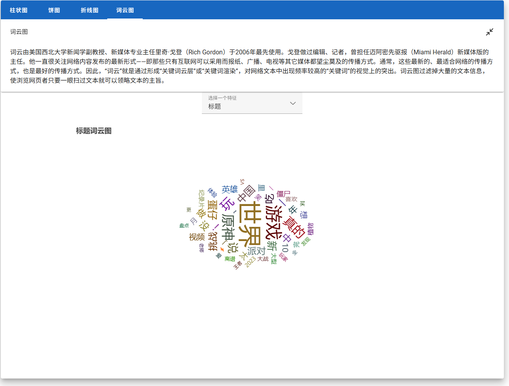

# 项目开发过程记录

## django 后端开发部分

### 问题 ① pyecharts 生成的图表问题（跨域资源共享问题）

方案一（不可用）：使用 pyecharts 生成的 html 直接通过 json 传递给 vue 前端并使用 v-html 显示图表。
由于 pyecharts 生成的 html 中有 script 需要执行。
且 v-html 指令出于 vue 框架对安全性的考虑无法执行 script 脚本故无法正确渲染图表。

方案二（没有意义）：将 pyecharts 生成的图表以静态图片 png、jpg 等方式直接保存到后端动态文件路径 media 下，并返回对应的路径给前端。这个方案会丧失 pyecharts 图表的动态交互性。

方案三（不便捷）：将 pyecharts 生成的图表直接以 html 的形式保存到后端动态文件路径 media 下，并返回对应的路径给前端。
前端使用 iframe 标签并给 src 属性指定返回的路径。这个方案需要在后端的 settings.py 设置对应的变量 X-Frame-Options 给所有返回的请求添加响应头。X-Frame-Options HTTP 响应头是用来给浏览器指示允许一个页面可否在 frame, iframe 或者 object 中展现的标记。网站可以使用此功能，来确保自己网站的内容没有被嵌套到别人的网站中去，也从而避免了点击劫持的攻击。

```
# settings.py
# 表示该页面不允许在frame中展示，即便是在相同域名的页面中嵌套也不允许。
X-Frame-Options = "DENY"

# 表示该页面可以在相同域名页面的frame中展示。通常使用此项。
X-Frame-Options = "SAMEORIGIN"

# 表示该页面可以在指定来源的frame中展示。
X-Frame-Options = "ALLOW-FROM uri"
```

使用了 X-Frame-Options 响应头可以在前端正常地显示图表，但我所使用的 edge 浏览器的控制台依然会报一个黄色警告。
并且该方案需要处理生成的图表在后端的缓存。

方案四：第三种方案可以说是方案一和方案三的结合，将 pyecharts 生成的 html 直接通过 json 传递给 vue 前端并使用 iframe 标签的 srcdoc 属性来显示图表。srcdoc 属性规定要显示在内联框架中的页面的 HTML 内容。该属性结合需求一般与 sandbox 和 seamless 属性一起使用。



## vue 前端开发部分

### 问题 ① vuetify 自定义图标集问题

vuetify 自定义的图表集的引入如下

```
import { createApp } from 'vue'
import App from './App.vue'

import { createVuetify } from 'vuetify'
import { aliases, custom } from '@/common/icons_setting'

const vuetify = createVuetify({
  icons: {
    defaultSet: 'custom',
    aliases,
    sets: {
      custom,
    },
  },
})

app.use(vuetify)
```

```
import { h } from 'vue'
import type { IconSet, IconAliases, IconProps } from 'vuetify'

const aliases: IconAliases = {
  home: 'home',
  ...
}

const custom: IconSet = {
  component: (props: IconProps) => {
    return h(...)
  },
}

export { aliases, custom }
```

方案一：通过 img 的 src 引入以 svg 格式存储的图标

```
const custom: IconSet = {
  component: (props: IconProps) => {
    const path = `/icons/${props.icon}.svg`
    return h("img", { src:path })
  },
}
```

这个方案引入的图标无法通过设置样式 fill 来实现变色（即设置 v-icon 标签的 color 属性无法变色）。

方案二：使用 css 样式添加阴影的方式、或者使用 vue-svg-loader 将 svg 文件以 vue 组件的形式引入的方式都不适合解决方案一导致的问题。前者不优雅，后者无法方便地解决动态加载图标的问题。

方案三：使用 svg-inject。这个库的核心功能在于它能自动替换 img 标签，将 SVG 图像文件转换为内联的 SVG 元素。这样可以直接通过 CSS 对 SVG 进行样式设置，并利用 JavaScript 进行交互控制。

```
const custom: IconSet = {
  component: (props: IconProps) => {
    const path = `/icons/${props.icon}.svg`
    return h('img', {
        src: path,
        onload: 'SVGInject(this)',
        style: {
          width: '100%',
          height: '100%',
        },
      })
  },
}
```

但这个方案会导致 vuetify 组件的图标切换出现问题，像 v-checkbox、v-radio 等组件需要进行图标切换时无法正确切换。
导致这个问题的原因我猜测与 vuetify 或 vue 或浏览器的缓存机制相关。或者由于缺少 vue 的响应式支持：vue 和 vuetify 依赖于响应式数据绑定来更新组件。如果该方案引入的图标元素没有一个响应式（动态）属性可以通知 vuetify 或者 vue 重新渲染图标，则可能导致无法切换的问题。简而言之，vuetify 的图标切换逻辑可能依赖于 vue 的响应式系统，而这个方案恰巧绕过了这一机制。
而且，该方案还会导致 v-icon 即使绑定了 click 事件，点击后无法执行事件。

方案四（最终解决方案）：嵌套一层父容器并设置父容器的 key 值，该方案可以完美解决上述出现的一系列问题。

```
const custom: IconSet = {
  component: (props: IconProps) => {
    // 使用svg-inject可以解决img引入svg文件无法变色的问题
    // 但是不知道为什么会影响v-checkbox和v-radio等其他会发生图标改变的组件使其无法正常切换图标
    // 解决方法①：单独设置这些组件使用的图标不使用svg-inject，但因此无法变色
    // 解决方法②：嵌套一层父容器并指定父容器的key值
    const path = `/icons/${props.icon}.svg`
    return h('i', { key: String(props.icon) }, [
      h('img', {
        src: path,
        onload: 'SVGInject(this)',
        style: {
          width: '100%',
          height: '100%',
        },
      }),
    ])
  },
}
```

### 问题 ② pinia 状态管理刷新丢失问题

原生的 pinia 状态管理在使用浏览器的刷新功能后（或者关闭网站、关闭浏览器时），所存储的数据会丢失，需要使用 pinia-plugin-persistedstate 或类似的 pinia 插件来实现持久化的状态管理。

```
export const useXXXStore = defineStore('xxx', {
  persist: {
    // 关闭网站或关闭浏览器时会丢失状态，但刷新则不会
    storage: sessionStorage,
    // 在本地（浏览器缓存中）存储状态，即使关闭网站或关闭浏览器也不会丢失状态
    // storage: localStorage,
  },
})
```

实际上这个持久化插件利用的就是 Web Storage 来实现的持久化。
在 HTML5 之前，开发人员一般是通过使用 Cookie 在客户端保存一些简单的信息的。在 HTML5 发布后，提供了一种新的客户端本地保存数据的方法，那就是 Web Storage，它也被分为：LocalStorage 和 SessionStorage，它允许通过 JavaScript 在浏览器中以键值对的形式保存数据。

# 项目缺陷

### 缺陷 ① 缺少加载交互

### 缺陷 ② 暂未测试，BUG 较多
